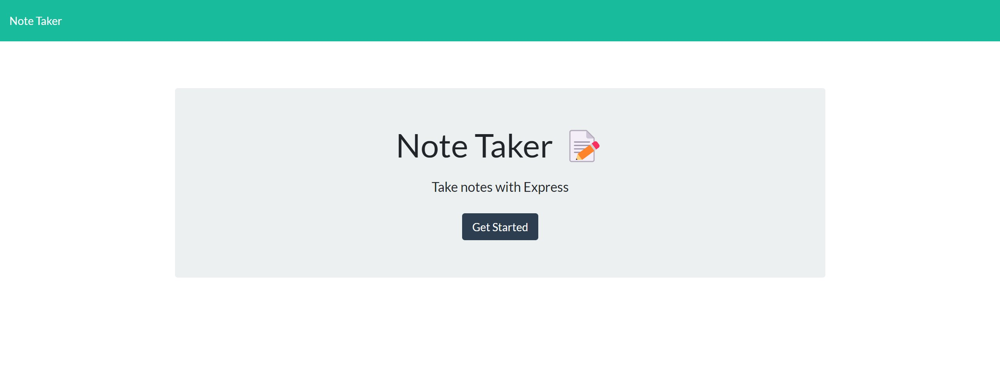
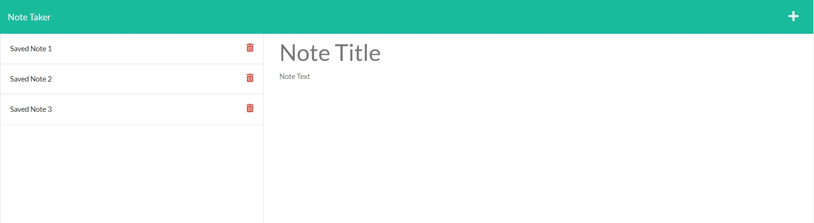

# Super Exciting Note Taking Machine!

## Table of Contents
[Description](#description)

[Installation](#installation)

[Usage](#usage)

[Screenshots](#screenshots)

[Credits](#credits)

[Dependencies and Libraries](#dependencies/libraries)

[Questions](#questions)

---

## Description
This is a web app that allows a user to write notes and save them to a local db file.
                
---     
## Installation
Navigate to the desired directory in git bash and type "git clone git@github.com:AGarraffa/takin-notes.git" (without quotes). Then in the same directory type "npm i" (without quotes) to install the necessary dependencies.
    
---
## Usage
Once the page loads you will see a button  to get started. Upon click, you will be taken to the notes page. From there you can click the Note Title or Note Text to enter in a new note. If you click the save icon in the top right (the disc) it will save and show on the left. If you click the saved notes, it will display the full note. You may also click the trash can icon to delete a note. 

    
---
## Credits
* Alfred Garraffa
* LindseyChoi 
* Amber Zimmerman 
* Dan Mrva 

---
## Dependencies/Libraries
* express 

---
## Questions
agarraffa@gmail.com

https://github.com/agarraffa

        
        
this file was created usings Alfred Garraffa's Readme generator